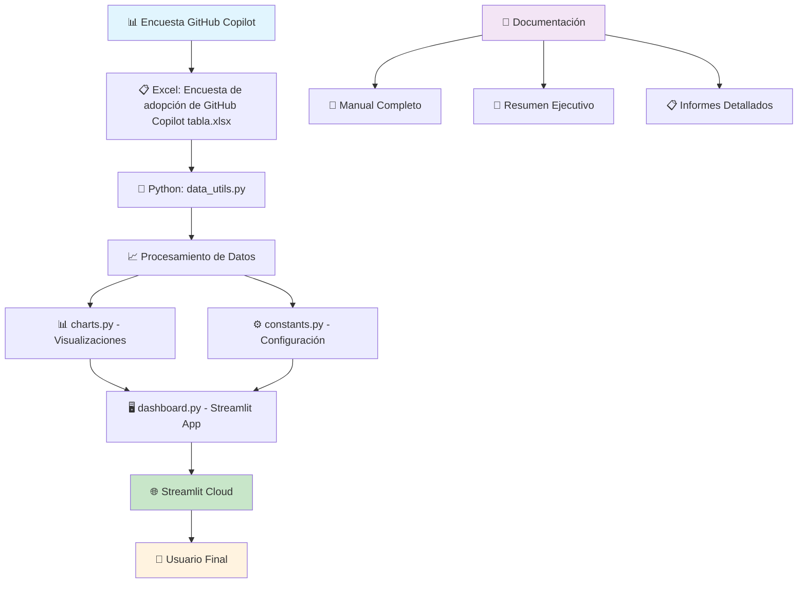
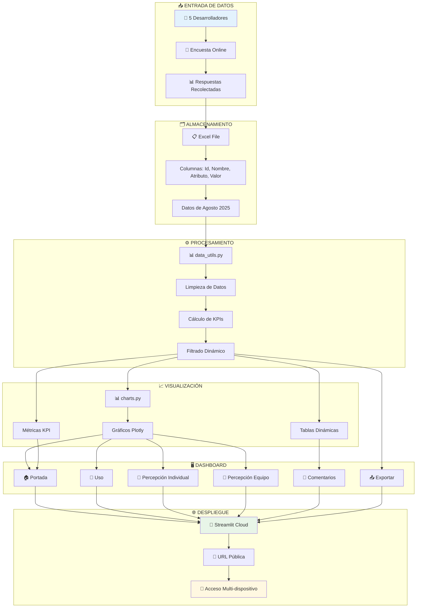
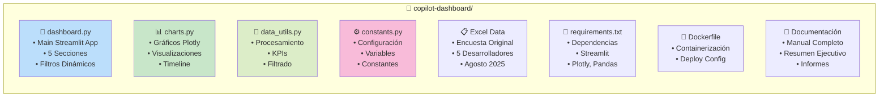
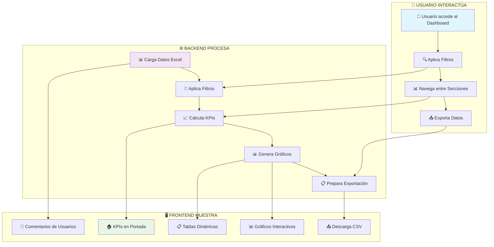
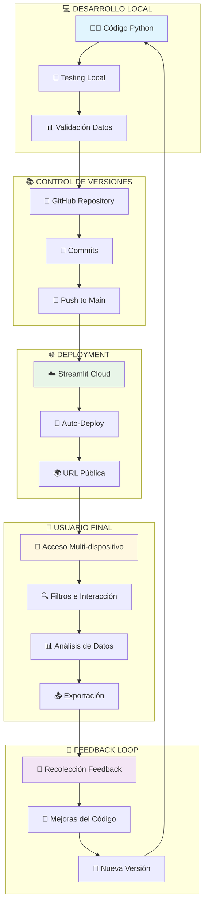
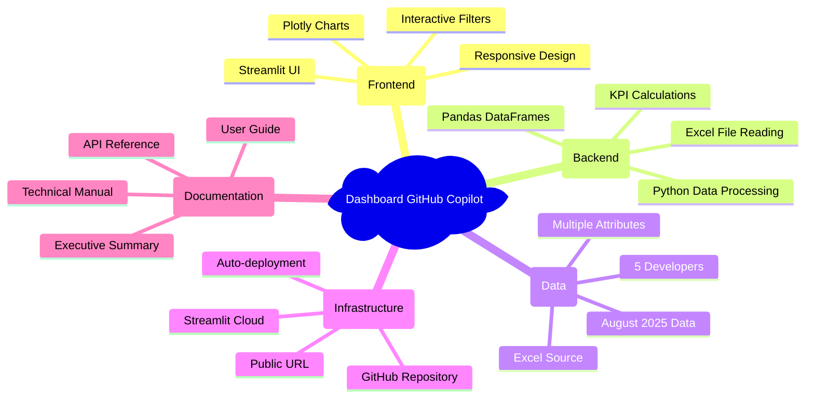
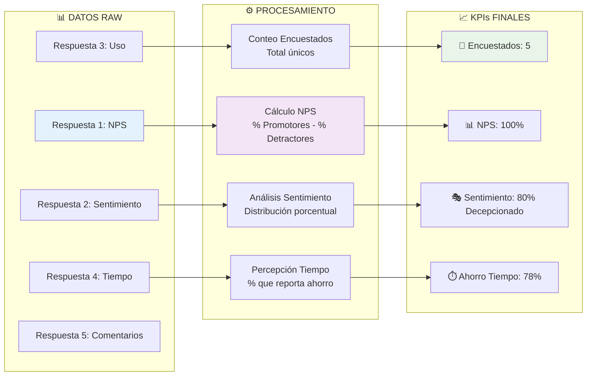

# DIAGRAMA DE FLUJO DEL PROYECTO
## Dashboard de Adopción GitHub Copilot - Tecno Acción S.A.

---

## 🏗️ ARQUITECTURA GENERAL DEL PROYECTO

---

## 🔄 FLUJO DE DATOS DETALLADO

---

## 📁 ESTRUCTURA DE ARCHIVOS

---

## 🔧 FLUJO DE FUNCIONALIDADES

---

## 📊 FLUJO DE DATOS POR SECCIÓN

```mermaid
graph TD
    subgraph "📋 DATOS FUENTE"
        D1[Excel: 5 Desarrolladores]
        D2[Atributos: Sentimiento, NPS, Uso, etc.]
        D3[Valores: Respuestas específicas]
        D1 --> D2 --> D3
    end
    
    subgraph "🏠 PORTADA"
        P1[👥 KPI: Encuestados = 5]
        P2[⏱️ KPI: Ahorro Tiempo = 78%]
        P3[🎭 Gráfico: Sentimiento Circular]
        P4[📊 Gráfico: NPS Circular]
        D3 --> P1
        D3 --> P2
        D3 --> P3
        D3 --> P4
    end
    
    subgraph "🚀 USO"
        U1[📊 Actividades: Todas sin Top N]
        U2[🔧 Modos de Uso]
        U3[📈 Patrones Temporales]
        D3 --> U1
        D3 --> U2
        D3 --> U3
    end
    
    subgraph "👤 PERCEPCIÓN INDIVIDUAL"
        I1[📊 Gráficos por Pregunta]
        I2[🚫 Sin Promedio]
        I3[🚫 Sin Likert]
        D3 --> I1
    end
    
    subgraph "👥 PERCEPCIÓN EQUIPO"
        T1[📊 Gráficos por Pregunta]
        T2[🚫 Sin Promedio]
        T3[🚫 Sin Likert]
        D3 --> T1
    end
    
    subgraph "💬 COMENTARIOS"
        C1[🚧 Impedimentos Individuales]
        C2[🎓 Capacitaciones Individuales]
        C3[💭 Comentarios Individuales]
        D3 --> C1
        D3 --> C2
        D3 --> C3
    end
    
    style D1 fill:#e3f2fd
    style P1 fill:#e8f5e8
    style U1 fill:#fff3e0
    style I1 fill:#fce4ec
    style T1 fill:#f3e5f5
    style C1 fill:#e0f2f1
```

---

## 🔄 CICLO DE DESARROLLO Y DEPLOYMENT

---

## 🧩 COMPONENTES TÉCNICOS

---

## 📈 FLUJO DE MÉTRICAS Y KPIs

---

## 🎯 PUNTOS CLAVE DEL FLUJO

### 📥 **INPUT (Entrada)**
- **Fuente**: Encuesta online a 5 desarrolladores
- **Formato**: Excel con estructura específica
- **Período**: Datos de Agosto 2025
- **Contenido**: Respuestas sobre uso, percepción y recomendación

### ⚙️ **PROCESSING (Procesamiento)**
- **Lenguaje**: Python con Pandas
- **Limpieza**: Normalización y validación de datos
- **Cálculos**: KPIs automáticos (NPS, porcentajes, conteos)
- **Filtrado**: Dinámico por persona y fecha

### 📊 **OUTPUT (Salida)**
- **Visualización**: Dashboard interactivo en Streamlit
- **Gráficos**: Plotly para interactividad
- **Exportación**: CSV descargables
- **Acceso**: URL pública responsive

### 🔄 **DEPLOYMENT (Despliegue)**
- **Repositorio**: GitHub con auto-deploy
- **Hosting**: Streamlit Cloud gratuito
- **Actualizaciones**: Automáticas desde commits
- **Accesibilidad**: Multi-dispositivo y navegador

### 👥 **USER EXPERIENCE (Experiencia)**
- **Navegación**: 5 secciones principales
- **Interacción**: Filtros dinámicos y exportación
- **Insights**: KPIs claros y visualizaciones intuitivas
- **Documentación**: Manual completo y guía ejecutiva

---

## 🚀 BENEFICIOS DE LA ARQUITECTURA

### ✅ **Escalabilidad**
- Fácil agregar nuevos desarrolladores o encuestas
- Estructura modular para nuevas funcionalidades
- Separación clara de responsabilidades

### 🔧 **Mantenibilidad**
- Código bien documentado y organizado
- Constantes centralizadas en `constants.py`
- Funciones reutilizables en módulos separados

### 📊 **Usabilidad**
- Interfaz intuitiva sin curva de aprendizaje
- Filtros dinámicos para análisis personalizado
- Exportación para análisis externos

### 🌐 **Accesibilidad**
- Deploy automático y gratuito
- Acceso desde cualquier dispositivo
- No requiere instalaciones locales

---

**📅 Versión**: 1.0 - Septiembre 2025  
**🏢 Proyecto**: Dashboard GitHub Copilot - Tecno Acción S.A.  
**👨‍💻 Desarrollado**: Con GitHub Copilot

---

*Este diagrama muestra el flujo completo desde la recolección de datos hasta la visualización final, incluyendo todos los componentes técnicos y funcionales del proyecto.*
